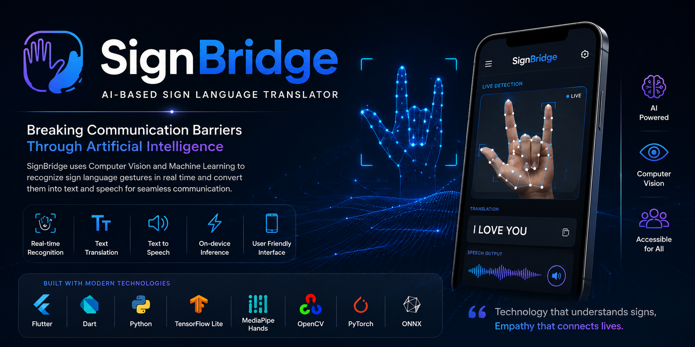

assets/banner.png

  

<h1 align="center">🤟 SignBridge</h1>

AI-Based Sign Language Translator

An AI-powered mobile application that translates sign language into text and speech in real time using Computer Vision and Machine Learning.

# 🤟 SignBridge

### AI-Based Sign Language Translator

An AI-powered mobile application that translates sign language into text and speech in real time using Computer Vision and Machine Learning.

---

## 📖 Overview

**SignBridge** is an AI-powered mobile application developed as a **Final Year Project** at **COMSATS University Islamabad, Sahiwal Campus**. The application recognizes sign language gestures using computer vision and translates them into readable text and speech in real time, helping bridge the communication gap between deaf or mute individuals and the hearing community.

---

## ✨ Key Features

- 🤟 Real-time Sign Language Recognition
- 📷 Live Camera Detection
- 🧠 AI-Powered Gesture Classification
- 🖐️ MediaPipe Hand Landmark Detection
- 📝 Instant Text Translation
- 🔊 Text-to-Speech Conversion
- ⚡ Fast On-device Inference
- 📱 User-friendly Mobile Interface

---

## ⚙️ How It Works

1. Capture hand gestures using the mobile camera.
2. Detect the hand using MediaPipe Hands.
3. Extract 21 hand landmarks.
4. Process landmarks using a TensorFlow Lite model.
5. Predict the corresponding sign.
6. Convert the prediction into text and speech.

---

## 🛠️ Technologies Used

| Category | Technologies |
|----------|-------------|
| Mobile Development | Flutter, Dart |
| AI & ML | TensorFlow Lite, PyTorch, ONNX |
| Computer Vision | MediaPipe Hands, OpenCV |
| Programming | Python |
| IDEs | Android Studio, Visual Studio Code |

---

## 🏛️ Project Information

**Project Name:** SignBridge – AI-Based Sign Language Translator

**University:** COMSATS University Islamabad, Sahiwal Campus

**Supervisor:** Dr. Yawar Abbas Abid

### 👨‍💻 Team Members

- Muhammad Uzair
- Zaryab Nadeem
- Hafiz Muhammad Umair Rana

---

## 📸 Project Gallery

> Screenshots and demonstration videos will be added here.

### Home Screen

### Live Detection

### Translation Result

---

## 🎥 Demonstration

A demo video of SignBridge will be available in this repository.

---

## 🏆 Exhibition

This project was successfully presented at the **Open House Expo 2026** held at **COMSATS University Islamabad, Sahiwal Campus**.

---

## 📌 Repository Notice

> This repository is intended for project showcase purposes only.

The source code, trained AI models, datasets, and implementation details are **not included**, as they are part of ongoing development and future enhancements.

---

## 📬 Contact

**Muhammad Uzair**

LinkedIn: *(Add your LinkedIn URL)*

Email: *(Add your email)*
